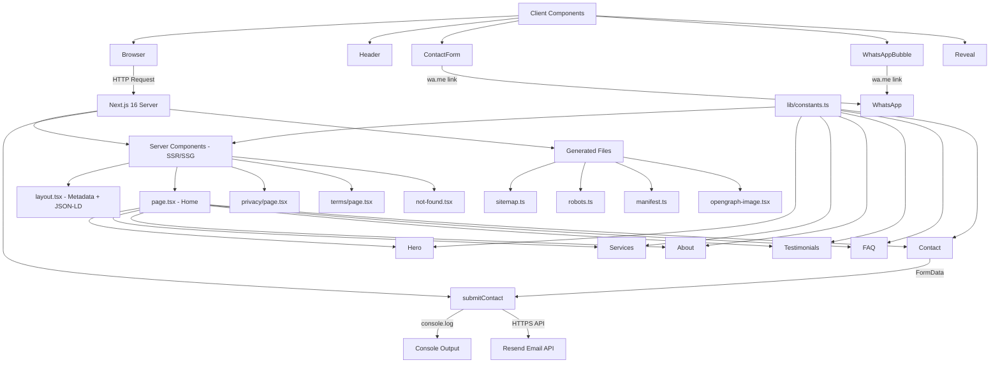
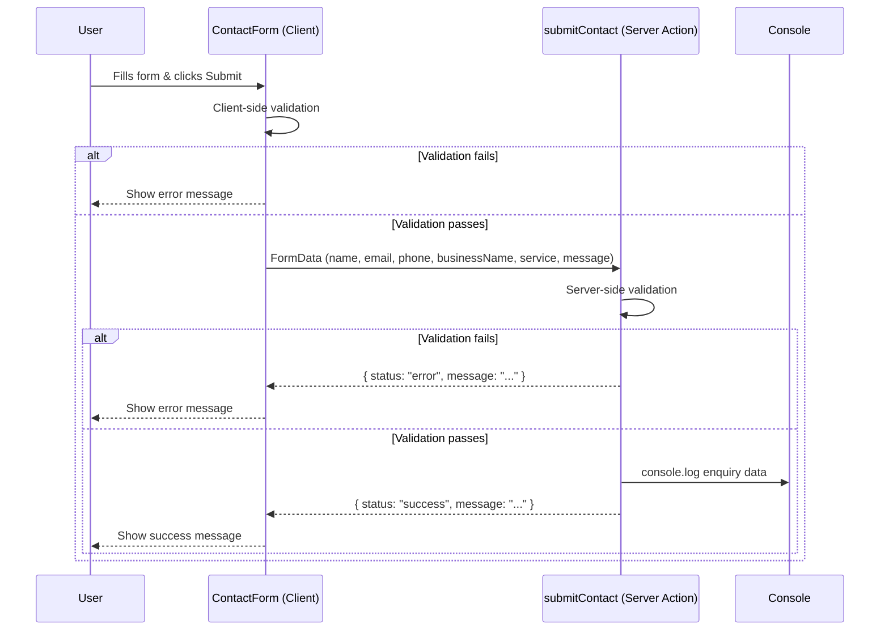
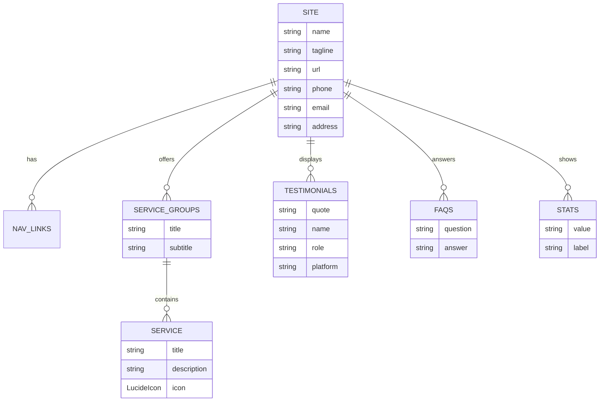

# PROJECT_CONTEXT.md — Consultancy Wala

> **Purpose:** This file is the single source of truth for writing complete project documentation.
> Every claim below is derived from actual code inspection. Items not found in the codebase are marked **"TBD / Not found in codebase"**.

---

## 1. Project Overview

| Field | Value |
|-------|-------|
| **Name** | Consultancy Wala |
| **Tagline** | Smart Solutions. Stronger Businesses. |
| **Repository** | `https://github.com/adityapandey2002/CW.git` |
| **Live URL** | `https://consultancywala.com` (default in code) |
| **Location** | Kumhrar, Patna, Bihar 800026, India |
| **Co-Founder** | Aditya Pandey |
| **License** | TBD / Not found in codebase |

**One-paragraph description:**
Consultancy Wala is a marketing website for an e-commerce growth agency based in Patna, India. The agency helps brands launch, scale, and dominate Indian marketplaces (Amazon, Flipkart, Meesho, JioMart, Nykaa) through services including seller onboarding, GST setup, product listing and cataloging, Amazon PPC ad campaigns, pricing strategy, account management, inventory/logistics support, brand protection, website development, and sales analytics.

**Problem it solves:**
Small and medium e-commerce sellers in India face complex marketplace onboarding (GST, brand approval, compliance), steep learning curves for advertising (PPC/ACOS optimization), and operational overhead (inventory, logistics, catalog health). Consultancy Wala offers an end-to-end managed service to handle these so sellers can focus on their product.

**Target users:**
- New e-commerce sellers wanting to launch on Amazon/Flipkart
- Existing sellers needing growth/marketing support
- Brands looking for full account management (A to Z)
- Small businesses seeking website development and analytics

**Core value proposition:**
Founder-led, ROI-first e-commerce growth agency with transparent pricing, handling everything from store launch to scale — strategy, PPC, cataloging, and operations — all in one place.

---

## 2. Features

### 2.1 Feature List with Status

| # | Feature | Module | Status | Notes |
|---|---------|--------|--------|-------|
| 1 | Home page with hero section | Frontend | **Implemented** | Headline, CTAs, stats grid |
| 2 | Services showcase (4 groups, 9 services) | Frontend | **Implemented** | Store Launch, Growth & Marketing, Operations & Protection, Custom Solutions |
| 3 | About section with company pillars | Frontend | **Implemented** | 4 pillars: Founder-Led, ROI-First, Transparent Pricing, Zero-to-Scale |
| 4 | Testimonials | Frontend | **Implemented** | 3 client testimonials with star ratings |
| 5 | FAQ accordion | Frontend | **Implemented** | 5 FAQs with AnimatePresence |
| 6 | Contact form with validation | Frontend + Server Action | **Implemented** | `useActionState` + server action; validates, sends email via Resend, honeypot anti-spam |
| 7 | WhatsApp floating chat button | Frontend | **Implemented** | Links to wa.me with pre-filled message |
| 8 | WhatsApp pre-filled message from form | Frontend | **Implemented** | Form data encoded into wa.me link |
| 9 | Sticky header with mobile menu | Frontend | **Implemented** | Hamburger menu for mobile |
| 10 | Footer with social links | Frontend | **Implemented** | 4-column layout |
| 11 | Privacy Policy page | Frontend | **Implemented** | DPDP Act 2023 aligned |
| 12 | Terms of Service page | Frontend | **Implemented** | — |
| 13 | Custom 404 page | Frontend | **Implemented** | Branded not-found |
| 14 | SEO: sitemap.xml | Backend (generated) | **Implemented** | 3 URLs: /, /privacy, /terms |
| 15 | SEO: robots.txt | Backend (generated) | **Implemented** | — |
| 16 | SEO: OpenGraph + Twitter cards | Backend (metadata) | **Implemented** | — |
| 17 | SEO: JSON-LD Organization schema | Backend (layout) | **Implemented** | schema.org Organization |
| 18 | PWA manifest | Backend (generated) | **Implemented** | — |
| 19 | Dynamic OG image (1200x630) | Backend (generated) | **Implemented** | opengraph-image.tsx |
| 20 | Scroll-reveal animations | Frontend | **Implemented** | Framer Motion, respects reduced-motion |
| 21 | Responsive design | Frontend | **Implemented** | Tailwind CSS v4 |
| 22 | Email notifications for contact form | Backend | **Implemented** | Resend in `actions/contact.ts`; API-level `error` is checked explicitly |
| 23 | Database / CMS | Backend | **Planned** | Not implemented; content in constants.ts |
| 24 | User authentication | Backend | **Planned** | Not implemented |
| 25 | Admin dashboard | Backend | **Planned** | Not implemented |

### 2.2 User Flows

**Flow A: Visitor learns about services and contacts via WhatsApp**
1. Visitor lands on home page (`/`)
2. Scrolls through Hero → Services → About → Testimonials → FAQ → Contact
3. Clicks WhatsApp CTA in hero or floating bubble
4. Opens WhatsApp with pre-filled message to `+91 8601862114`
5. Sends message; agency responds

**Flow B: Visitor submits contact form**
1. Visitor scrolls to Contact section
2. Fills in: Name, Email, Phone, Business Name, Service (dropdown), Message
3. Client-side validation checks required fields (name, email, phone, message)
4. Email format validated via regex
5. Form submits to `submitContact` server action
6. Server action validates again (length caps, email format, phone digits) and sanitizes control characters
7. Returns success state: "Thanks! Our team will reach out within 24 hours."
8. Sends the enquiry to the agency inbox via Resend; only metadata (masked email/phone) is logged

**Flow C: Visitor reads legal pages**
1. Visitor clicks "Privacy Policy" or "Terms" in footer
2. Navigates to `/privacy` or `/terms`
3. Renders shared `LegalPage` component with prose content

---

## 3. Tech Stack

| Layer | Technology | Version | Purpose |
|-------|-----------|---------|---------|
| **Framework** | Next.js | 16.3.5 | App Router, SSR/SSG, server actions, metadata API |
| **UI Library** | React | 19.2.8 | Component model, hooks |
| **Language** | TypeScript | ^5 | Type safety |
| **Styling** | Tailwind CSS | ^4 | Utility-first CSS, CSS-based config (no tailwind.config) |
| **PostCSS Plugin** | @tailwindcss/postcss | ^4 | Tailwind v4 integration |
| **Animations** | Framer Motion | ^13.3.0 | Scroll-reveal, accordion animations |
| **Icons** | Lucide React | ^1.46.0 | Service and UI icons |
| **Class Merge** | clsx + tailwind-merge | ^2.1.1 / ^3.7.0 | Conditional class merging (`cn()` helper) |
| **Font** | Plus Jakarta Sans | (Google Fonts) | Primary typeface via next/font/google |
| **Linting** | ESLint | ^9 | Code quality |
| **ESLint Config** | eslint-config-next | 16.3.5 | Next.js + core-web-vitals + TypeScript rules |
| **Package Manager** | npm | — | package-lock.json present |
| **Deployment** | Vercel (implied) | — | README says "Deploy to Vercel with a single click" |
| **Database** | None | — | Static content only |
| **ORM** | None | — | — |
| **API Framework** | None | — | Only server action, no REST/GraphQL |

**Why each is used:**
- **Next.js 16:** Provides App Router, server components, server actions, file-based routing, and built-in SEO utilities (metadata, sitemap, robots, manifest) — all used in this project.
- **React 19:** Required by Next.js; latest version for performance and features.
- **Tailwind CSS v4:** New CSS-first configuration approach; no separate config file needed; design tokens defined in `globals.css` via `@theme`.
- **Framer Motion:** Used for scroll-reveal animations (`Reveal` component) and FAQ accordion (`AnimatePresence`).
- **Lucide React:** Tree-shakeable icon set for service cards and UI elements.
- **TypeScript:** Strict mode enabled; type safety across components and server actions.

---

## 4. Architecture

### 4.1 High-Level Architecture

```
┌─────────────────────────────────────────────────────────┐
│                      Browser (Client)                     │
│  React Components + Framer Motion + Tailwind CSS         │
│  - Header, Footer, Sections, ContactForm, WhatsAppBubble │
└──────────────────────────┬──────────────────────────────┘
                           │ HTTP (Server Action POST)
┌──────────────────────────▼──────────────────────────────┐
│                 Next.js 16 Server                         │
│  ┌─────────────────────────────────────────────────┐    │
│  │  Server Components (SSR/SSG)                     │    │
│  │  - layout.tsx (metadata, JSON-LD)                │    │
│  │  - page.tsx (composes sections)                  │    │
│  │  - privacy/page.tsx, terms/page.tsx               │    │
│  │  - sitemap.ts, robots.ts, manifest.ts            │    │
│  │  - opengraph-image.tsx                           │    │
│  └─────────────────────────────────────────────────┘    │
│  ┌─────────────────────────────────────────────────┐    │
│  │  Server Actions                                   │    │
│  │  - actions/contact.ts (submitContact)            │    │
│  └─────────────────────────────────────────────────┘    │
│  ┌─────────────────────────────────────────────────┐    │
│  │  Static Content                                   │    │
│  │  - lib/constants.ts (all site data)              │    │
│  └─────────────────────────────────────────────────┘    │
└─────────────────────────────────────────────────────────┘
                           │
                           ▼
              ┌──────────────────────┐
              │  External Services   │
              │  - WhatsApp (wa.me)  │
              │  - Google Fonts      │
              │  - Instagram         │
              │  - LinkedIn          │
              └──────────────────────┘
```

### 4.2 Component Communication

- **Server Components** fetch no data; they import static content from `lib/constants.ts` directly.
- **Client Components** (`"use client"`) handle interactivity:
  - `Header` — mobile menu toggle
  - `ContactForm` — form state, validation, calls `submitContact` server action
  - `WhatsAppBubble` — floating button, links to wa.me
  - `Reveal` — Framer Motion scroll animations
  - `Faq` — accordion with AnimatePresence
- **Server Actions** are the only server-side logic: `submitContact` receives FormData, validates, logs, returns state.

### 4.3 Mermaid Architecture Diagram



### 4.4 Request Flow (Contact Form)



---

## 5. Folder and File Structure

```
CW/
├── .git/                          Git repository (7 commits)
├── .gitignore                     Ignores node_modules, .next, .env*, etc.
├── AGENTS.md                      Next.js 16 agent rules (auto-generated)
├── CLAUDE.md                      Imports @AGENTS.md
├── README.md                      Project documentation
├── PROJECT_CONTEXT.md             This file
├── eslint.config.mjs              ESLint config (next/core-web-vitals + typescript)
├── next.config.ts                 Next.js config (empty)
├── package.json                   Dependencies and scripts
├── package-lock.json              Lock file
├── postcss.config.mjs             PostCSS config (@tailwindcss/postcss)
├── tsconfig.json                  TypeScript config (strict, @/* path alias)
│
├── actions/
│   └── contact.ts                 Server action: submitContact (form validation + console log)
│
├── app/
│   ├── favicon.ico                Browser favicon
│   ├── globals.css                Tailwind v4 theme, design tokens, utilities
│   ├── icon.svg                   Site icon (SVG)
│   ├── layout.tsx                 Root layout: fonts, metadata, viewport, JSON-LD
│   ├── manifest.ts                PWA manifest generator
│   ├── not-found.tsx              Custom 404 page
│   ├── opengraph-image.tsx        Dynamic OG image (1200x630)
│   ├── page.tsx                   Home page (composes all sections)
│   ├── robots.ts                  robots.txt generator
│   ├── sitemap.ts                 sitemap.xml generator
│   ├── privacy/
│   │   └── page.tsx               Privacy Policy (DPDP Act 2023)
│   └── terms/
│       └── page.tsx               Terms of Service
│
├── components/
│   ├── contact-form.tsx           Client component: form with server action
│   ├── footer.tsx                 Site footer (4 columns)
│   ├── header.tsx                 Sticky navbar + mobile hamburger menu
│   ├── legal-page.tsx             Shared shell for legal pages
│   ├── logo.tsx                   Brand logo (dark/light variants)
│   ├── reveal.tsx                 Framer Motion scroll-reveal wrapper
│   ├── section-heading.tsx        Shared section heading component
│   ├── social-icons.tsx           Inline SVG icons (WhatsApp, Instagram, LinkedIn)
│   ├── whatsapp-bubble.tsx        Floating WhatsApp chat button
│   ├── sections/
│   │   ├── about.tsx              About section with 4 pillars
│   │   ├── contact.tsx            Contact info cards + contact form
│   │   ├── faq.tsx                FAQ accordion (5 items)
│   │   ├── hero.tsx               Hero with headline, CTAs, stats
│   │   ├── services.tsx           Services showcase (4 groups, 9 services)
│   │   └── testimonials.tsx       Testimonials (3 clients)
│   └── ui/
│       ├── button.tsx             Button + ButtonLink with variants
│       ├── card.tsx               Simple rounded card wrapper
│       ├── input.tsx              Styled input field
│       ├── label.tsx              Styled form label
│       ├── select.tsx             Styled select with chevron
│       └── textarea.tsx           Styled textarea
│
└── lib/
    ├── constants.ts               ALL site content (single source of truth)
    └── utils.ts                   cn() class-merge helper
```

---

## 6. Database Design

**No database exists in this project.**

This is a static marketing website with no database, no ORM, no migrations, and no data models. All content is stored in `lib/constants.ts` as TypeScript constants.

### Content "Schema" (TypeScript types in constants.ts)

**SITE** — Site-wide configuration:
| Field | Type | Example |
|-------|------|---------|
| name | string | "Consultancy Wala" |
| tagline | string | "Smart Solutions. Stronger Businesses." |
| hero | string | "Your E-Commerce Growth Partner." |
| coFounder | string | "Aditya Pandey" |
| url | string | `process.env.NEXT_PUBLIC_SITE_URL ?? "https://consultancywala.com"` |
| phone | string | "+91 8601862114" |
| phoneHref | string | "+918601862114" |
| whatsappHref | string | wa.me link with pre-filled message |
| email | string | "support.consultancywala@gmail.com" |
| address | string | "Kumhrar, Patna, Bihar 800026" |
| instagram | string | URL |
| linkedin | string | URL |

**NAV_LINKS** — Array of `{ label: string; href: string }` (5 items)

**SERVICE_GROUPS** — Array of `ServiceGroup`:
| Field | Type |
|-------|------|
| title | string |
| subtitle | string |
| services | Service[] |

**Service** — `{ title: string; description: string; icon: LucideIcon }`

**TESTIMONIALS** — Array of `{ quote: string; name: string; role: string; platform: string }` (3 items)

**FAQS** — Array of `{ question: string; answer: string }` (5 items)

**STATS** — Array of `{ value: string; label: string }` (4 items)

### Mermaid ER Diagram (Conceptual)



---

## 7. API / Backend Documentation

### 7.1 API Routes

**No REST/GraphQL API routes exist.** There is no `app/api/` directory.

### 7.2 Server Actions

#### `submitContact`

| Field | Value |
|-------|-------|
| **File** | `actions/contact.ts` |
| **Type** | Next.js Server Action (`"use server"`) |
| **Purpose** | Process contact form submissions |
| **Auth required** | No |
| **Rate limiting** | None |

**Request (FormData):**

| Field | Type | Required | Validation |
|-------|------|----------|------------|
| name | string | Yes | Non-empty after trim |
| email | string | Yes | Non-empty + regex `/^[^\s@]+@[^\s@]+\.[^\s@]+$/` |
| phone | string | Yes | Non-empty after trim |
| businessName | string | No | — |
| service | string | No | — |
| message | string | Yes | Non-empty after trim |

**Response (`ContactFormState`):**

```typescript
type ContactFormState = {
  status: "idle" | "success" | "error";
  message?: string;
};
```

**Success response:**
```json
{ "status": "success", "message": "Thanks! Our team will reach out within 24 hours." }
```

**Error responses:**
```json
{ "status": "error", "message": "Please fill in your name, email, phone and message so we can reach you back." }
```
```json
{ "status": "error", "message": "Please enter a valid email address." }
```

**Current behavior:** Sends the enquiry to the agency inbox via Resend. Because the Resend SDK resolves with `{ data, error }` rather than throwing, the returned `error` is checked explicitly so a failed send cannot be reported to the user as success. Logs store metadata only (masked email/phone), never full PII.

### 7.3 Middleware

**None.** No `middleware.ts` file exists.

### 7.4 Authentication & Authorization

**None.** No auth system exists. The site is fully public.

---

## 8. Frontend Documentation

### 8.1 Pages/Routes

| Route | File | Type | Description |
|-------|------|------|-------------|
| `/` | `app/page.tsx` | Server Component | Home page composing all sections |
| `/privacy` | `app/privacy/page.tsx` | Server Component | Privacy Policy |
| `/terms` | `app/terms/page.tsx` | Server Component | Terms of Service |
| 404 | `app/not-found.tsx` | Server Component | Custom branded 404 |

### 8.2 Key Components

| Component | File | Type | Description |
|-----------|------|------|-------------|
| `Header` | `components/header.tsx` | Client | Sticky navbar, mobile hamburger menu |
| `Footer` | `components/footer.tsx` | Server | 4-column footer with social links |
| `Logo` | `components/logo.tsx` | Server | Brand logo dark/light variants |
| `Reveal` | `components/reveal.tsx` | Client | Framer Motion scroll-reveal wrapper |
| `SectionHeading` | `components/section-heading.tsx` | Server | Eyebrow + title + subtitle |
| `SocialIcons` | `components/social-icons.tsx` | Server | WhatsApp, Instagram, LinkedIn SVGs |
| `LegalPage` | `components/legal-page.tsx` | Server | Shared shell for legal pages |
| `ContactForm` | `components/contact-form.tsx` | Client | Form with server action integration |
| `WhatsAppBubble` | `components/whatsapp-bubble.tsx` | Client | Floating WhatsApp button with ping animation |
| `Button` / `ButtonLink` | `components/ui/button.tsx` | Server | Button with variants (primary, outline, ghost, light) |
| `Card` | `components/ui/card.tsx` | Server | Rounded card wrapper |
| `Input` | `components/ui/input.tsx` | Server | Styled input |
| `Label` | `components/ui/label.tsx` | Server | Form label |
| `Select` | `components/ui/select.tsx` | Server | Styled select with chevron |
| `Textarea` | `components/ui/textarea.tsx` | Server | Styled textarea |

### 8.3 Page Sections (composed in `app/page.tsx`)

| Section | File | Description |
|---------|------|-------------|
| Hero | `components/sections/hero.tsx` | Headline, CTAs, stats grid (50+ brands, 10+ marketplaces, 500+ listings, 40Cr+ GMV) |
| Services | `components/sections/services.tsx` | 4 service groups with 9 total services |
| About | `components/sections/about.tsx` | Company story + 4 pillars |
| Testimonials | `components/sections/testimonials.tsx` | 3 client testimonials with star ratings |
| FAQ | `components/sections/faq.tsx` | 5 FAQs with accordion (AnimatePresence) |
| Contact | `components/sections/contact.tsx` | Contact info cards + contact form |

### 8.4 State Management

- **No global state management** (no Redux, Zustand, Context API).
- **Local component state** via React `useState`:
  - `Header`: mobile menu open/closed
  - `ContactForm`: form submission state (idle/success/error)
  - `Faq`: accordion open index
- **Server Action state** passed back to `ContactForm` for success/error display.

### 8.5 Styling Approach

- **Tailwind CSS v4** with CSS-based configuration in `app/globals.css`
- **Design tokens** defined via `@theme` directive:
  - Brand colors: navy, orange, magenta, purple
  - Signature gradient: `bg-cta-gradient` / `gradient-text`
  - Grid background utility: `bg-grid`
- **Custom font:** Plus Jakarta Sans via `next/font/google`
- **Scoped styles:** `.legal-prose` for privacy/terms content
- **Responsive:** Tailwind breakpoints (mobile-first)

### 8.6 Forms and Validation

**Contact Form** (`components/contact-form.tsx`):
- Fields: name, email, phone, businessName, service (select), message
- Client-side validation: required fields checked before submission
- Server-side validation: `submitContact` re-validates all fields
- Email validation: regex `/^[^\s@]+@[^\s@]+\.[^\s@]+$/`
- Success/error messages displayed inline
- Form resets on success

---

## 9. Business Logic

### 9.1 Contact Form Processing

1. User submits form with name, email, phone, businessName, service, message
2. Client-side: checks required fields (name, email, phone, message)
3. Server-side: re-validates, checks email format
4. Sends the email via Resend; on success logs metadata only and returns a success message
5. On failure: returns specific error message
6. Honeypot field `company_website` short-circuits bot submissions before any email is sent

### 9.2 WhatsApp Integration

- Floating bubble links to `https://wa.me/918601862114?text=Hi%20Consultancy%20Wala%2C%20I%20want%20to%20grow%20my%20e-commerce%20business.`
- Contact form can build pre-filled WhatsApp messages from form data
- All WhatsApp links use `rel="noopener noreferrer"`

### 9.3 Pricing Model (from FAQ content)

- Transparent monthly retainer + performance component for ads
- Free discovery call before quoting
- Fixed quote after discovery — no hidden charges

### 9.4 Roles/Permissions

**None.** No user roles or permissions exist. The site is fully public with no admin area.

### 9.5 Notifications

- **Email:** Implemented via Resend (sender address from `RESEND_FROM_EMAIL`)
- **WhatsApp:** Primary communication channel
- **Console logging:** Metadata-only audit trail (masked email/phone); not a notification channel

---

## 10. Third-Party Integrations

| Service | Purpose | Status | How It's Wired |
|---------|---------|--------|----------------|
| **WhatsApp** | Primary contact channel | **Implemented** | `wa.me` links in hero, contact form, floating bubble |
| **Google Fonts** | Typography (Plus Jakarta Sans) | **Implemented** | `next/font/google` in `layout.tsx` |
| **Instagram** | Social media link | **Implemented** | URL in `constants.ts`, rendered in footer/social icons |
| **LinkedIn** | Social media link | **Implemented** | URL in `constants.ts`, rendered in footer/social icons |
| **Vercel** | Deployment platform | **Implied** | README instructs `npx vercel` |
| **Email (Resend)** | Contact form notifications | **Implemented** | `actions/contact.ts`; key from `RESEND_API_KEY`, sender from `RESEND_FROM_EMAIL` |
| **Analytics** | Site analytics | **TBD / Not found in codebase** | No analytics script found |
| **Maps** | Location display | **TBD / Not found in codebase** | Address is text only |
| **Payment Gateway** | Payments | **TBD / Not found in codebase** | No payment integration |
| **SMS** | Notifications | **TBD / Not found in codebase** | Not implemented |

---

## 11. Configuration and Environment

### 11.1 Environment Variables

| Variable | File | Default | Purpose |
|----------|------|---------|---------|
| `NEXT_PUBLIC_SITE_URL` | `lib/constants.ts` line 21 | `https://consultancywala.com` | Used for sitemap, robots, manifest, metadataBase, canonical URLs, OpenGraph |

**No `.env.example` file exists.** The README documents this variable.

### 11.2 Config Files

| File | Purpose |
|------|---------|
| `next.config.ts` | Next.js configuration (currently empty) |
| `tsconfig.json` | TypeScript: ES2017 target, strict mode, `@/*` path alias, bundler resolution |
| `postcss.config.mjs` | PostCSS with `@tailwindcss/postcss` |
| `eslint.config.mjs` | ESLint with `eslint-config-next` (core-web-vitals + typescript) |
| `.gitignore` | Ignores node_modules, .next, out, build, .env*, .vercel |

### 11.3 Build and Run Commands

```bash
# Install dependencies
npm install

# Development server
npm run dev

# Production build (includes TypeScript check)
npm run build

# Production server
npm run start

# Linting
npm run lint
```

---

## 12. Setup and Installation

### 12.1 Prerequisites

- Node.js (version not specified in package.json; Next.js 16 requires Node 18.18+)
- npm
- Git

### 12.2 Step-by-Step Local Setup

```bash
# 1. Clone the repository
git clone https://github.com/adityapandey2002/CW.git
cd CW

# 2. Install dependencies
npm install

# 3. (Optional) Set environment variable
# Create .env.local with:
# NEXT_PUBLIC_SITE_URL=http://localhost:3000

# 4. Start development server
npm run dev

# 5. Open browser
# http://localhost:3000
```

### 12.3 Testing

- **No test setup exists.** No test files, no test framework, no test scripts in package.json.
- Manual testing: `npm run dev` and verify pages render.

### 12.4 Build

```bash
npm run build
```

This runs TypeScript type checking and creates an optimized production build in `.next/`.

---

## 13. Deployment

| Aspect | Details |
|--------|---------|
| **Platform** | Vercel (implied by README) |
| **Method** | `npx vercel` or Git integration |
| **Domain** | `https://consultancywala.com` (default in code) |
| **CI/CD** | TBD / Not found in codebase (no GitHub Actions, no CI config files) |
| **Environment** | `NEXT_PUBLIC_SITE_URL` must be set in Vercel env vars |
| **Build command** | `npm run build` (default for Vercel + Next.js) |
| **Output** | Static/SSG (Next.js default) |

---

## 14. Security and Performance

### 14.1 Security

| Measure | Status | Details |
|---------|--------|---------|
| Authentication | N/A | Public site, no auth needed |
| Input validation | **Implemented** | Server action validates all fields |
| Email validation | **Implemented** | Regex check in `submitContact` |
| XSS prevention | **Implemented** | React escapes by default; `dangerouslySetInnerHTML` only for static JSON-LD |
| External link safety | **Implemented** | `rel="noopener noreferrer"` on external links |
| Rate limiting | **Not implemented** | No rate limiting on contact form |
| CSRF protection | **Implemented** (implicit) | Next.js Server Actions include CSRF protection |
| Secrets in code | **Clean** | No secrets found; only env var name referenced |
| HTTPS | **Implied** | Vercel provides HTTPS by default |

### 14.2 Performance

| Measure | Status | Details |
|---------|--------|---------|
| Font optimization | **Implemented** | `next/font/google` with `display: "swap"` |
| Image optimization | **Implemented** | Next.js Image component (where used) |
| Static generation | **Implemented** | Pages are Server Components (SSG by default) |
| Bundle optimization | **Implemented** | Tree-shaking via Lucide React icons |
| Reduced motion | **Implemented** | `Reveal` component respects `prefers-reduced-motion` |
| Caching | **TBD / Not found in codebase** | No explicit caching headers or ISR config |
| Lazy loading | **TBD / Not found in codebase** | No explicit lazy loading patterns |
| CDN | **Implied** | Vercel Edge Network |

### 14.3 SEO

| Measure | Status | Details |
|---------|--------|---------|
| Meta tags | **Implemented** | Full metadata in `layout.tsx` |
| OpenGraph | **Implemented** | OG tags in metadata |
| Twitter Cards | **Implemented** | `summary_large_image` |
| Canonical URLs | **Implemented** | `alternates.canonical` |
| Sitemap | **Implemented** | `app/sitemap.ts` (3 URLs) |
| Robots.txt | **Implemented** | `app/robots.ts` |
| JSON-LD | **Implemented** | Organization schema in `layout.tsx` |
| Semantic HTML | **Implemented** | Proper heading hierarchy, main/header/footer |
| 404 handling | **Implemented** | Custom `not-found.tsx` |
| PWA | **Implemented** | `app/manifest.ts` |

---

## 15. Testing

| Aspect | Status | Details |
|--------|--------|---------|
| Test framework | **Not found** | No Jest, Vitest, Playwright, or Cypress |
| Test files | **None** | No `*.test.*` or `*.spec.*` files |
| Test scripts | **None** | No `test` script in package.json |
| Coverage | **N/A** | No tests exist |
| E2E testing | **Not found** | No E2E setup |
| Manual testing | **Implied** | `npm run dev` and browser verification |

---

## 16. Known Issues, Limitations, and Technical Debt

### 16.1 TODO/FIXME Comments

| File | Line | Issue |
|------|------|-------|
| _(none)_ | — | No TODO/FIXME comments remain in the source tree. |

### 16.2 Incomplete Areas

| Area | Status | Impact |
|------|--------|--------|
| Contact form email notifications | **Implemented** | Sent via Resend; requires a verified sender domain (`RESEND_FROM_EMAIL`) in production |
| No database | **By design** | Content is hardcoded in `constants.ts`; no CMS for non-technical users |
| No admin panel | **Not implemented** | All content changes require code edits |
| No analytics | **Not implemented** | No visibility into traffic, conversions, or user behavior |
| Honeypot only, no rate limiting | **Partial** | `company_website` honeypot + server-side length caps block naive bots; there is still no per-IP rate limit (see Future Enhancements) |
| No tests | **Not implemented** | No automated quality assurance |
| No CI/CD | **Not found** | No automated build/deploy pipeline visible in repo |

### 16.3 Hardcoded Values

| Location | Value | Risk |
|----------|-------|------|
| `constants.ts` | Phone number, email, address | Changing requires code edit + redeploy |
| `constants.ts` | WhatsApp message text | Changing requires code edit + redeploy |
| `constants.ts` | All service descriptions, testimonials, FAQs | Changing requires code edit + redeploy |
| `layout.tsx` | JSON-LD schema | Static; won't reflect content changes automatically |

### 16.4 Technical Debt

- **Next.js 16.3.5** is very new with breaking changes (per AGENTS.md); may have undocumented behavior
- **No `.env.example`** file; only documented in README
- **No error boundary** (`error.tsx` mentioned in README but not found in file listing — may be auto-generated or missing)
- **No loading states** for pages (no `loading.tsx` files)
- **No not-found for sub-pages** beyond root 404

---

## 17. Future Enhancements

Based on TODOs and code patterns:

1. **Verify the sending domain** — Set `RESEND_FROM_EMAIL` to an address on a domain verified in Resend; without it, production delivery fails silently-by-design (the API error is surfaced to the user, but no mail arrives)
2. **Analytics** — Add Vercel Analytics, Google Analytics, or Plausible for traffic insights
3. **CMS integration** — Move `constants.ts` content to a headless CMS (Sanity, Contentful) for non-technical editing
4. **Blog/Resources section** — Add SEO-driven content marketing pages
5. **Case studies** — Detailed portfolio pages with results/metrics
6. **Multi-language support** — Hindi language option (Hinglish tone already in FAQs)
7. **Rate limiting** — Add rate limiting to contact form (e.g., Vercel KV + rate limit)
8. **Testing** — Add unit tests for server action, E2E tests for critical flows
9. **CI/CD** — GitHub Actions for lint + build on PR
10. **Admin dashboard** — Simple admin for managing testimonials, FAQs, services
11. **Chat widget** — Replace WhatsApp-only with multi-channel chat (WhatsApp + web chat)
12. **Lead tracking** — Track form submissions in a database for follow-up

---

## 18. Development History

### Git Log (7 commits, oldest first)

| Hash | Message | Inferred Milestone |
|------|---------|-------------------|
| `f365592` | first commit | Initial project setup |
| `99595fb` | first commit | (duplicate message) |
| `b790f24` | Initial commit: setup project and ignore build folders | Project scaffolding, .gitignore |
| `44b89d0` | doing project | Development work |
| `d66d705` | doing project | Development work |
| `c45a37f` | correcting SEO | SEO improvements |
| `2054f9c` | correcting SEO | SEO improvements |

### Key Decisions Inferred from Code

1. **Static site over dynamic** — Chose a fully static marketing site with no database, keeping it simple and fast
2. **WhatsApp-first lead flow** — Primary CTA is WhatsApp (wa.me links), not a traditional form-to-email flow
3. **Single source of truth** — All content centralized in `lib/constants.ts` for easy editing
4. **Server Actions over API routes** — Used Next.js Server Actions for form handling instead of REST API
5. **Tailwind v4 CSS-first config** — Adopted new Tailwind v4 approach with `@theme` in CSS instead of JS config
6. **Framer Motion for animations** — Chose Framer Motion for scroll reveals and accordion animations
7. **No auth/admin** — Kept the site fully public with no backend complexity

---

## 19. Screenshots / Diagrams Needed

### Screenshots to Capture

| # | Screen | URL | Purpose |
|---|--------|-----|---------|
| 1 | Home page — full | `/` | Overall design reference |
| 2 | Hero section | `/` (top) | Value proposition clarity |
| 3 | Services section | `/` (scroll) | Service offerings display |
| 4 | About section | `/` (scroll) | Company story |
| 5 | Testimonials section | `/` (scroll) | Social proof |
| 6 | FAQ section | `/` (scroll) | Common questions |
| 7 | Contact section | `/` (bottom) | Lead capture form |
| 8 | Mobile view — home | `/` (mobile) | Responsive design |
| 9 | Mobile menu open | `/` (mobile, menu open) | Navigation UX |
| 10 | Privacy Policy page | `/privacy` | Legal compliance |
| 11 | Terms of Service page | `/terms` | Legal compliance |
| 12 | 404 page | `/non-existent` | Error handling |
| 13 | WhatsApp bubble | `/` (floating) | Contact channel visibility |
| 14 | Contact form — success state | `/` (after submit) | Form feedback |
| 15 | Contact form — error state | `/` (invalid input) | Validation display |

### Diagrams to Create

| # | Diagram | Purpose |
|---|---------|---------|
| 1 | Architecture diagram | System overview |
| 2 | Component hierarchy | Frontend structure |
| 3 | Contact form flow | User journey |
| 4 | SEO/Metadata flow | How metadata propagates |
| 5 | Deployment pipeline | Build to production |

---

## 20. Glossary and Quick Facts

### Domain Terms

| Term | Definition |
|------|------------|
| **ACOS** | Advertising Cost of Spend — ad spend as percentage of ad revenue; lower is better |
| **A+ Content** | Enhanced product descriptions on Amazon (images, comparison charts) |
| **Brand Approval** | Amazon's process to verify brand ownership before selling |
| **Catalog Health** | Metric for completeness and quality of product listings |
| **FBA** | Fulfillment by Amazon — Amazon stores, ships, and handles returns |
| **FBM** | Fulfillment by Merchant — Seller handles storage and shipping |
| **GST** | Goods and Services Tax — required for Indian marketplace selling |
| **GMV** | Gross Merchandise Value — total sales volume processed |
| **Listing** | Product page on a marketplace |
| **Marketplace** | E-commerce platform (Amazon, Flipkart, Meesho, etc.) |
| **PPC** | Pay-Per-Click advertising on marketplaces |
| **Seller Central** | Amazon's seller dashboard |
| **Sponsored Products** | Amazon's PPC ad format for individual products |

### Project Statistics

| Metric | Count |
|--------|-------|
| Pages | 3 (+ 404) |
| Routes | 4 (/, /privacy, /terms, 404) |
| Server Actions | 1 |
| API Routes | 0 |
| Components | 18+ |
| Page Sections | 6 |
| Services | 9 (in 4 groups) |
| Testimonials | 3 |
| FAQs | 5 |
| Stats | 4 |
| Nav Links | 5 |
| Environment Variables | 1 |
| Database Tables | 0 |
| Test Files | 0 |
| Total Dependencies | 14 (6 prod + 8 dev) |
| Git Commits | 7 |
| Contributors | 1 (Aditya Pandey) |

### License

TBD / Not found in codebase

### Contributors

- **Aditya Pandey** — Co-Founder, Developer (sole contributor based on git history)

---

## Coverage Report

### Fully Documented Sections

| Section | Status | Notes |
|---------|--------|-------|
| 1. Project Overview | **Complete** | All info from constants.ts and README |
| 2. Features | **Complete** | All features identified from code |
| 3. Tech Stack | **Complete** | All deps from package.json |
| 4. Architecture | **Complete** | Full component tree and data flow |
| 5. Folder Structure | **Complete** | Every file accounted for |
| 6. Database Design | **Complete** | N/A — no database exists; documented as such |
| 7. API/Backend | **Complete** | Only server action documented |
| 8. Frontend | **Complete** | All components, pages, sections |
| 9. Business Logic | **Complete** | Contact flow, WhatsApp, pricing |
| 10. Third-Party Integrations | **Complete** | All integrations identified |
| 11. Configuration | **Complete** | All env vars and config files |
| 12. Setup/Installation | **Complete** | Step-by-step from README |
| 13. Deployment | **Complete** | Vercel implied from README |
| 14. Security/Performance | **Complete** | All measures assessed |
| 15. Testing | **Complete** | Confirmed: no tests exist |
| 16. Known Issues | **Complete** | All TODOs and gaps identified |
| 17. Future Enhancements | **Complete** | Based on code patterns |
| 18. Development History | **Complete** | From git log |
| 19. Screenshots Needed | **Complete** | Listed |
| 20. Glossary/Quick Facts | **Complete** | All stats counted |

### Partial Sections

| Section | What's Missing |
|---------|----------------|
| 13. Deployment | No CI/CD config files found; deployment inferred from README only |
| 14. Security | No rate limiting; no caching headers found |
| 18. Development History | Commit messages are vague ("doing project"); milestones inferred |

### Information Needed from You

| # | Information Needed | Why |
|---|-------------------|-----|
| 1 | **Business goals** | What are the primary KPIs? (leads, calls, brand awareness?) |
| 2 | **Target audience details** | Specific industries, company sizes, geographies? |
| 3 | **Screenshots** | 15 screens listed in Section 19 |
| 4 | **License** | What license is the project under? |
| 5 | **Deployment details** | Is it actually deployed on Vercel? Any other platform? |
| 6 | **Analytics** | Is there any analytics running (even if not in code)? |
| 7 | **Email provider preference** | Resend, Nodemailer, or other for the TODO? |
| 8 | **Planned features** | What's on the roadmap beyond code TODOs? |
| 9 | **Team size** | Is this a solo project or is there a team? |
| 10 | **Monetization** | How does the agency acquire clients beyond this site? |

---

*End of PROJECT_CONTEXT.md*
