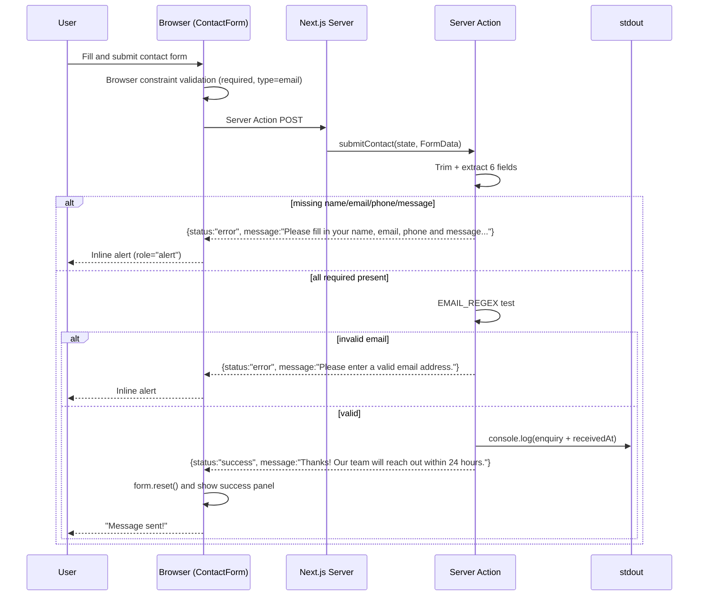
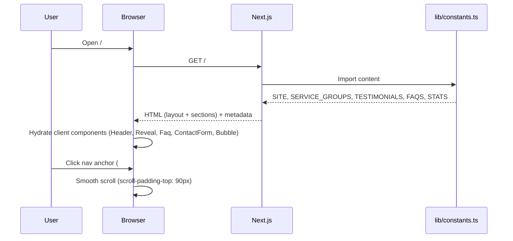
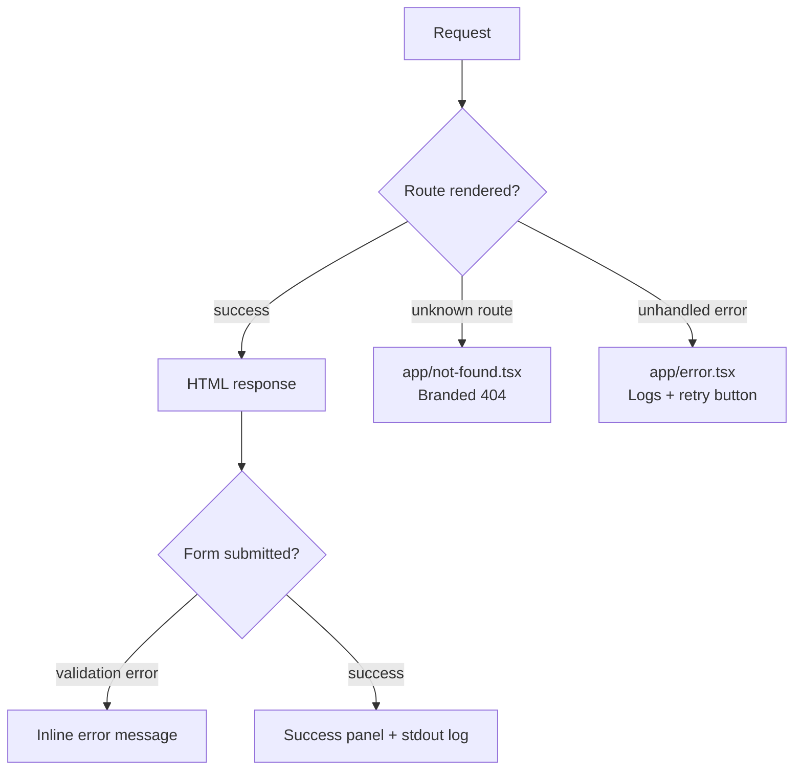

# Application Flow Diagram

## Contact Submission (primary interactive flow)

```mermaid
sequenceDiagram
  participant U as User
  participant B as Browser (ContactForm)
  participant N as Next.js Server
  participant S as Server Action
  participant L as stdout

  U->>B: Fill and submit contact form
  B->>B: Browser constraint validation (required, type=email)
  B->>N: Server Action POST
  N->>S: submitContact(state, FormData)
  S->>S: Trim + extract 6 fields
  alt missing name/email/phone/message
    S-->>B: {status:"error", message:"Please fill in your name, email, phone and message..."}
    B-->>U: Inline alert (role="alert")
  else all required present
    S->>S: EMAIL_REGEX test
    alt invalid email
      S-->>B: {status:"error", message:"Please enter a valid email address."}
      B-->>U: Inline alert
    else valid
      S->>L: console.log(enquiry + receivedAt)
      S-->>B: {status:"success", message:"Thanks! Our team will reach out within 24 hours."}
      B->>B: form.reset() and show success panel
      B-->>U: "Message sent!"
    end
  end
```

## Page Load and Navigation

```mermaid
sequenceDiagram
  participant U as User
  participant B as Browser
  participant N as Next.js
  participant C as lib/constants.ts

  U->>B: Open /
  B->>N: GET /
  N->>C: Import content
  C-->>N: SITE, SERVICE_GROUPS, TESTIMONIALS, FAQS, STATS
  N-->>B: HTML (layout + sections) + metadata
  B->>B: Hydrate client components (Header, Reveal, Faq, ContactForm, Bubble)
  U->>B: Click nav anchor (#services)
  B->>B: Smooth scroll (scroll-padding-top: 90px)
```

## Error Paths

```mermaid
flowchart TD
  A[Request] --> B{Route rendered?}
  B -- success --> C[HTML response]
  B -- unknown route --> D[app/not-found.tsx<br/>Branded 404]
  B -- unhandled error --> E[app/error.tsx<br/>Logs + retry button]
  C --> F{Form submitted?}
  F -- validation error --> G[Inline error message]
  F -- success --> H[Success panel + stdout log]
```

See `docs/05-application-workflows.md` for the written walkthroughs.